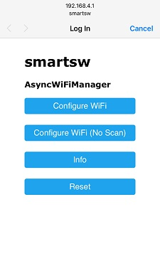
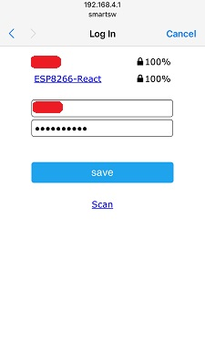
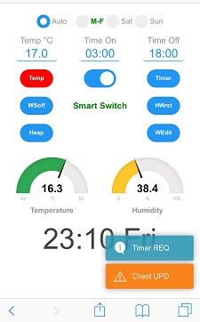
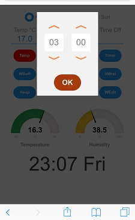

         

## SmartSwitch
- Remote Temperature Control application with schedule 
   (example: car block heater or car battery charger for winter)
- Based on [ESP_AsyncFSBrowser](https://github.com/lorol/ESPAsyncWebServer/tree/master/examples/ESP_AsyncFSBrowser)  example that uses embedded ACE editor 
- Wide browser compatibility, no extra server-side needed
- HTTP server and WebSocket on same port 
- Standalone, no JS dependencies for the browser from Internet
- [Ace Editor](https://github.com/ajaxorg/ace) embedded to source but also - editable, upgradeable see  [extras folder](https://github.com/lorol/ESPAsyncWebServer/tree/master/extras)
- Added [ESPAsyncWiFiManager](https://github.com/alanswx/ESPAsyncWiFiManager) and fallback AP mode after timeout
- Real Time (NTP) w/ Time Zones. Sync from browser time if in AP mode
- Memorized settings to EEPROM
- Multiple clients can be connected at same time, they see each other' requests
- Authentication variants including [Cookie-based](https://github.com/me-no-dev/ESPAsyncWebServer/pull/684) idea
- Used [this Xtea implementation](https://github.com/franksmicro/Arduino/tree/master/libraries/Xtea) for getting a fancier Cookie token
- Default credentials **smart : switch** or only **switch** as password
- OTA included
- Use the latest ESP8266 ESP32 cores from GitHub