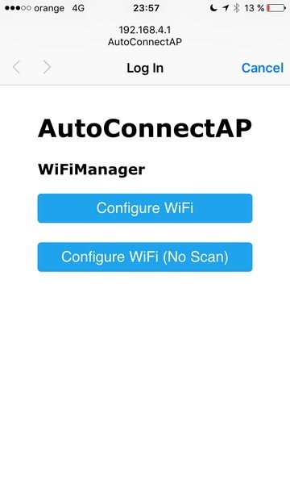
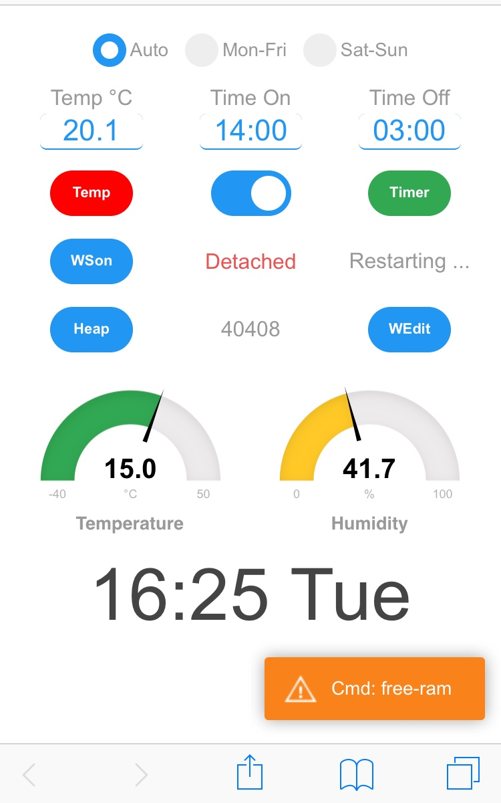

  

## SmartSwitch
* Remote Temperature Control application with schedule (example car block heater or battery charger)
* Based on ESP_AsyncFSBrowser example
* Wide browser compatibility, no extra server-side needed.
* HTTP server and WebSocket, single port  
* Standalone, no JS dependencies for the browser from Internet (I hope), ace editor included
* Added ESPAsyncWiFiManager
* Real Time (NTP) w/ Time Zones
* Memorized settings to EEPROM
* Multiple clients can be connected at same time, they see each other' requests
* Default credentials <b>smart:switch</b>
* Use latest ESP8266 core lib (from Github)
